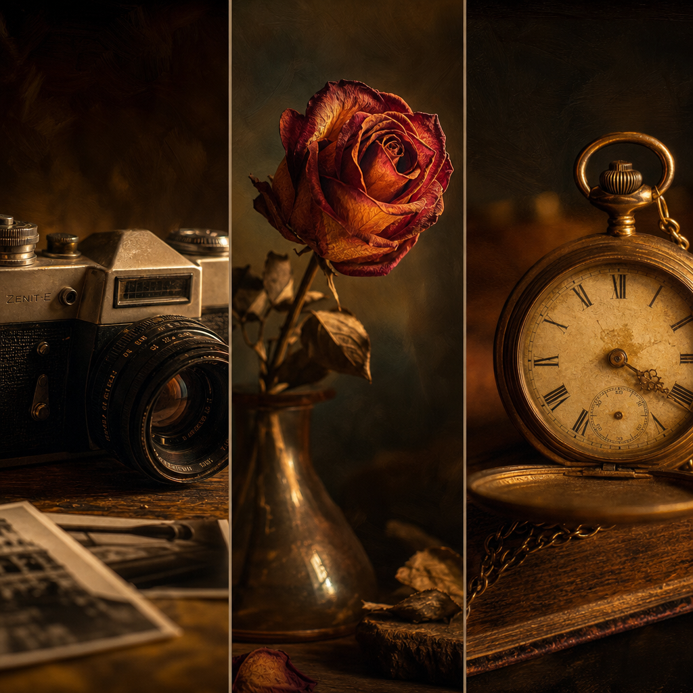
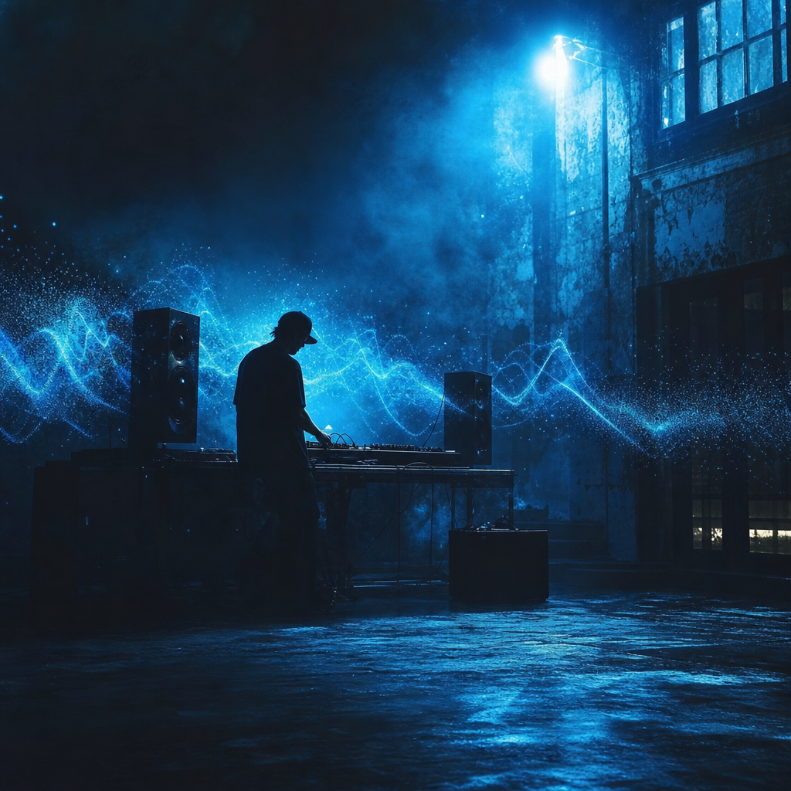
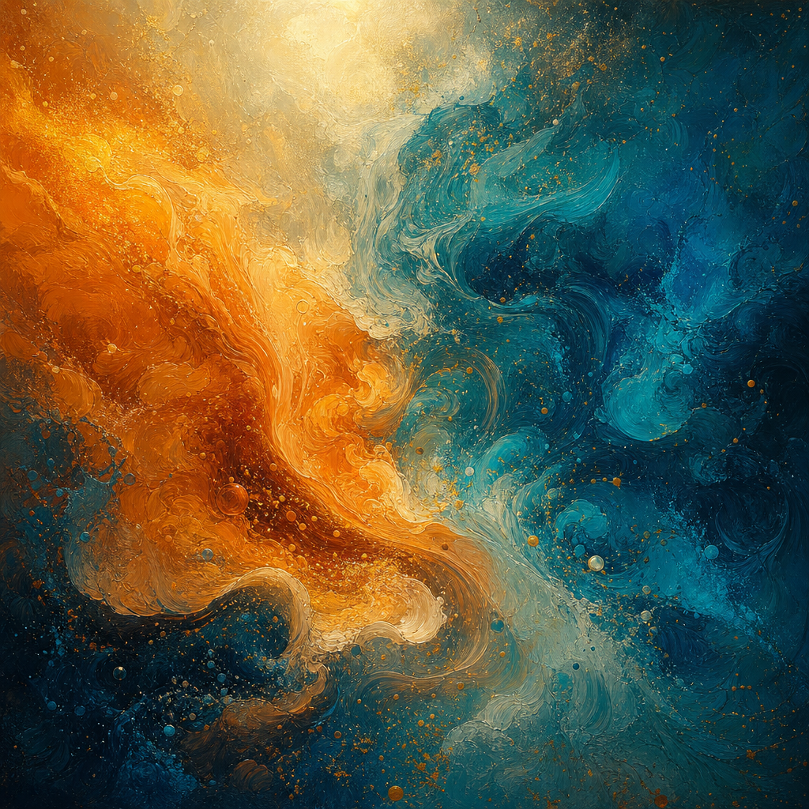

# 5 הכללים החשובים ביותר ביצירת וידאו ותמונות עם בינה מלאכותית

## מדריך ליוצרי תוכן AI שרוצים שהיצירה תיראה כמו שלהם — לא כמו של המודל

כשהבינה המלאכותית הפכה לכלי עבודה יומיומי, התחרות הויזואלית עברה ממכשירים לאסתטיקה. כל אחד יכול להפעיל מודל. הפחות יודעים איך לגרום לו להוציא **משהו שמרגיש כמו שלהם**.

הכללים הבאים זוקקו מאלפי איטרציות בפועל — סטוריבורדים, ניסויים, כישלונות וגילויים מקריים. הם לא קסם. הם משמעת.

---

## כלל 1 — תכננו לפני שתפעילו את המודל

**הטעות הנפוצה ביותר:** לפתוח את Midjourney/Veo/Kling ולהקליד. בלי כיוון, בלי מצב רגשי, בלי תכנון מבנה.

**מה לעשות במקום:**
- נייר ועט. כותבים את **התחושה** שאתם רוצים שהצופה ירגיש בשנייה ה-3, ה-15, ה-29.
- מפרקים את הסרטון לבלוקים של 5 שניות. כל בלוק מקבל "פונקציה" אחת: hook, reveal, payoff.
- רק אחרי שיש לכם בריף של 30 שניות שאתם יכולים לקרוא בקול — תפעילו את המודל.

> **למה זה עובד?** המודל לא חושב במונחים של "סיפור". הוא מייצר frames. אתם זה שצריכים להחזיק את המסע. בלי תכנון, כל פרומפט הוא יריית פתיחה לכיוון אחר.

---

## כלל 2 — עקביות ויזואלית היא לא אופציה

קל לייצר תמונה אחת מדהימה. הקושי הוא לייצר **עשר תמונות שמרגישות אחיות**.

**שלושה דברים שצריכים להישאר זהים לאורך כל הפרויקט:**

1. **פלטת צבעים** — בחרו 3-4 צבעים דומיננטיים והכריחו את המודל אליהם בכל פרומפט.
2. **תאורה** — שעת זהב? נורות ניאון? תאורת סטודיו רכה? נעלו את זה כבר בתמונה הראשונה.
3. **קומפוזיציה** — close-up vs. wide, מרכזי vs. off-center. תשמרו על קצב ויזואלי.

**טריק מעשי:** השתמשו ב-reference images כקלט למודל (תמיכת `--cref`, `--sref`, או image-to-image). המודל "ינשום" את הסגנון שלכם במקום להמציא אחד חדש כל פעם.

---

## כלל 3 — המוזיקה היא המסגרת. תייצרו אותה ראשונה.

יוצרי תוכן רבים מייצרים את הוויזואל קודם, ואז "מחפשים מוזיקה שמתאימה". זו טעות שעולה ימי עריכה.

**הסדר הנכון:**

1. **מוזיקה / פסקול** (Suno, Udio, או הלחנה עצמית)
2. **תמונות בסיס** — פרומפטים שמדברים את הטון של הפסקול
3. **תנועה** (Veo, Kling, Runway) — תזמון שמתכתב עם החיתוכים המוזיקליים
4. **עריכה** — חיתוכים נעולים על beats, transitions על דרופים

**שורה תחתונה:** הקצב, הצבע והאנרגיה של המוזיקה הם המצפן. הוויזואל הוא תוצר. לא להיפך.

---

## כלל 4 — חבקו את הבריחות

ה-Gen AI יברח לכם מהמסגרת. זה לא באג, זו תכונה.

תמונה אחת מתוך עשר תהיה **טובה יותר ממה שתכננתם**. תנועה אחת תיצור זווית שלא חשבתם עליה. המודל יציע פילטר/אווירה/דמות שמשפרים את הסיפור.

**הכלל החשוב באמת:** אל תילחמו בזה. **תעדכנו את החזון שלכם.**

יוצרי תוכן בינוניים מאלצים את המודל לעשות בדיוק מה שתכננו. יוצרי תוכן מעולים מזהים מתי המודל גילה משהו טוב יותר — וכותבים את הסטוריבורד מחדש.

> זה השילוב היחיד שמייצר תוצר **ייחודי**: השליטה שלכם פוגשת את המקריות של ה-AI.

---

## כלל 5 — רגש קודם לטכנולוגיה

הצופה שלכם לא יזכור איזה מודל השתמשתם בו, איך פתרתם את ה-prompt engineering, או כמה seeds רצתם.

**הוא יזכור** את הרגע שעיניים נדלקו. את הצחוק של הילדה. את הנשימה שעצרה את הפעולה.

**איך לבדוק את עצמכם:**
- שלחו את העריכה הראשונית לחבר שלא מכיר AI. תשאלו: "מה הרגשת?"
- אם התשובה היא "וואו, איזה אפקטים מגניבים" — נכשלתם.
- אם התשובה היא "האישה הזו... היא מי?" — הצלחתם.

הטכנולוגיה היא העיפרון. הסיפור הוא הציור.

---

## סיכום

חמשת הכללים האלה לא יהפכו אתכם ליוצרים גדולים אם הסיפור שלכם שטוח. הם **יוודאו** שהסיפור שלכם לא ידולל על ידי הכלי.

- **תכננו.** המודל הוא מבצע, לא במאי.
- **שמרו על DNA ויזואלי.** עשר תמונות אחיות עדיפות ממאה תמונות זרות.
- **התחילו במוזיקה.** היא נותנת את המסגרת.
- **חבקו את הבריחות.** המקריות היא חברה.
- **רגש קודם.** תמיד.

יוצרי התוכן הטובים בעולם של 2026 הם לא אלו שמפעילים את המודלים הכי חדשים. הם אלו שיודעים מה הם רוצים שירגישו — ומפעילים את הכלים ככלים.

---

## קרדיטים

**Liraz Golan**
*Visual AI Creator*
